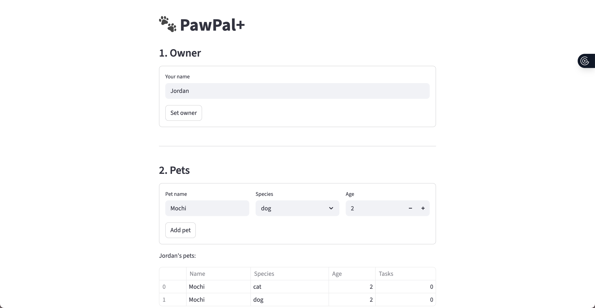

# PawPal+ (Module 2 Project)

You are building **PawPal+**, a Streamlit app that helps a pet owner plan care tasks for their pet.

## Scenario

A busy pet owner needs help staying consistent with pet care. They want an assistant that can:

- Track pet care tasks (walks, feeding, meds, enrichment, grooming, etc.)
- Consider constraints (time available, priority, owner preferences)
- Produce a daily plan and explain why it chose that plan

Your job is to design the system first (UML), then implement the logic in Python, then connect it to the Streamlit UI.

## What you will build

Your final app should:

- Let a user enter basic owner + pet info
- Let a user add/edit tasks (duration + priority at minimum)
- Generate a daily schedule/plan based on constraints and priorities
- Display the plan clearly (and ideally explain the reasoning)
- Include tests for the most important scheduling behaviors

## Demo



## Features

- **Greedy daily scheduling** — `Scheduler.build_daily_plan()` sorts all pending tasks by priority, frequency, and duration, then greedily selects tasks until the available time or task cap is reached.
- **Priority & frequency ordering** — high-priority daily tasks are always considered first; low-priority as-needed tasks sort last, ensuring the most important care happens within constrained windows.
- **Chronological sorting** — `Scheduler.sort_by_time()` orders tasks by `start_time` (HH:MM) so the final schedule reads top-to-bottom through the day. Tasks with no start time are placed at the end.
- **Conflict detection** — `Scheduler.detect_conflicts()` checks every pair of timed tasks for overlapping windows and surfaces a `st.warning()` for each conflict, without throwing an error.
- **Daily recurrence** — when a `daily` or `weekly` task is marked complete, `Task.mark_complete()` automatically queues a fresh pending copy on the pet, so recurring care never falls off the list.
- **Blackout times** — the scheduler filters out tasks whose preferred time slot (morning / afternoon / evening) is blocked by the owner, with a skip reason recorded in the plan.
- **Multi-pet support** — an `Owner` aggregates multiple `Pet` objects; `get_all_tasks()` and `get_tasks_by_pet()` flatten or group tasks across the whole household.
- **Single-pet ownership enforcement** — `Pet.add_task()` raises a `ValueError` if a task is added to a second pet, preventing accidental data sharing between pets.
- **Task filtering** — `Scheduler.filter_tasks()` narrows the task list by completion status, pet name, or both, making it easy to show only what's pending or done.

## Getting started

### Setup

```bash
python -m venv .venv
source .venv/bin/activate  # Windows: .venv\Scripts\activate
pip install -r requirements.txt
```

### Suggested workflow

1. Read the scenario carefully and identify requirements and edge cases.
2. Draft a UML diagram (classes, attributes, methods, relationships).
3. Convert UML into Python class stubs (no logic yet).
4. Implement scheduling logic in small increments.
5. Add tests to verify key behaviors.
6. Connect your logic to the Streamlit UI in `app.py`.
7. Refine UML so it matches what you actually built.

## Testing PawPal+

Run the test suite with:

```bash
python -m pytest tests/test_pawpal.py -v
```

What the tests cover:

| Area                   | Tests                                                                                                 |
| ---------------------- | ----------------------------------------------------------------------------------------------------- |
| **Sorting**            | Tasks are returned in chronological order by `start_time`; tasks with no `start_time` sort to the end |
| **Recurrence**         | Completing a `daily` task automatically queues a fresh pending copy; `monthly` tasks do not re-queue  |
| **Conflict detection** | Overlapping time windows are flagged with a warning; back-to-back and untimed tasks are not flagged   |

Confidence Level: 4/5

Core scheduling behaviors — sorting, recurrence, and conflict detection — are well-covered and all 10 tests pass. A full 5-star rating would require additional coverage of `build_daily_plan` edge cases (zero available minutes, `max_tasks` cap) and integration-level tests through the Streamlit UI.
