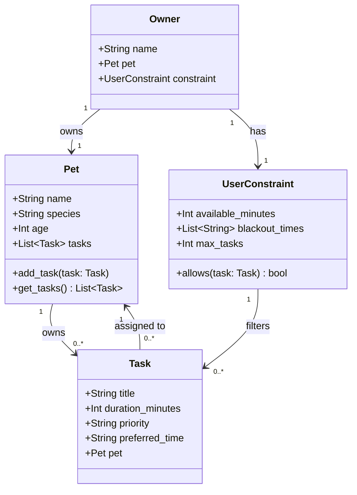

# PawPal+ Project Reflection

## 1. System Design

**a. Initial design**

- Briefly describe your initial UML design.
- What classes did you include, and what responsibilities did you assign to each?

A user should be able to view all tasks, add tasks, and add constraints.

Classes:
Owner: Has pets
Pet: One single pet, holds data about it and what tasks correspond to it
Task: Assigned to a pet, has information about the task
UserConstraint: Owner's limitations

**b. Design changes**

- Did your design change during implementation?
- If yes, describe at least one change and why you made it.

Yes. I added a method to the UserConstraint class that made it check if the task's preferred time is in the owner's blackout times and if it exceeds the available time. I made this change to accomodate the preferences so that the scheduler could work around them.

But then I realized that on the website in Phase 2, it said I should have these core classes:
Task: Represents a single activity (description, time, frequency, completion status).
Pet: Stores pet details and a list of tasks.
Owner: Manages multiple pets and provides access to all their tasks.
Scheduler: The "Brain" that retrieves, organizes, and manages tasks across pets.

So I changed my design to match this.

---

## 2. Scheduling Logic and Tradeoffs

**a. Constraints and priorities**

- What constraints does your scheduler consider (for example: time, priority, preferences)?
- How did you decide which constraints mattered most?

**b. Tradeoffs**

- Describe one tradeoff your scheduler makes.
- Why is that tradeoff reasonable for this scenario?
  The scheduler picks tasks in sorted order (priority > frequency > duration) so it might waste time by doing a long task first when it could have done two short tasks in the same time. However, I think this is reasonable because the owner would probably want to get the most important tasks done first, and if they have time left over, they can do the less important ones.

---

## 3. AI Collaboration

**a. How you used AI**

- How did you use AI tools during this project (for example: design brainstorming, debugging, refactoring)?
- What kinds of prompts or questions were most helpful?

**b. Judgment and verification**

- Describe one moment where you did not accept an AI suggestion as-is.
- How did you evaluate or verify what the AI suggested?

---

## 4. Testing and Verification

**a. What you tested**

- What behaviors did you test?
- Why were these tests important?

**b. Confidence**

- How confident are you that your scheduler works correctly?
- What edge cases would you test next if you had more time?

---

## 5. Reflection

**a. What went well**

- What part of this project are you most satisfied with?

**b. What you would improve**

- If you had another iteration, what would you improve or redesign?

**c. Key takeaway**

- What is one important thing you learned about designing systems or working with AI on this project?
