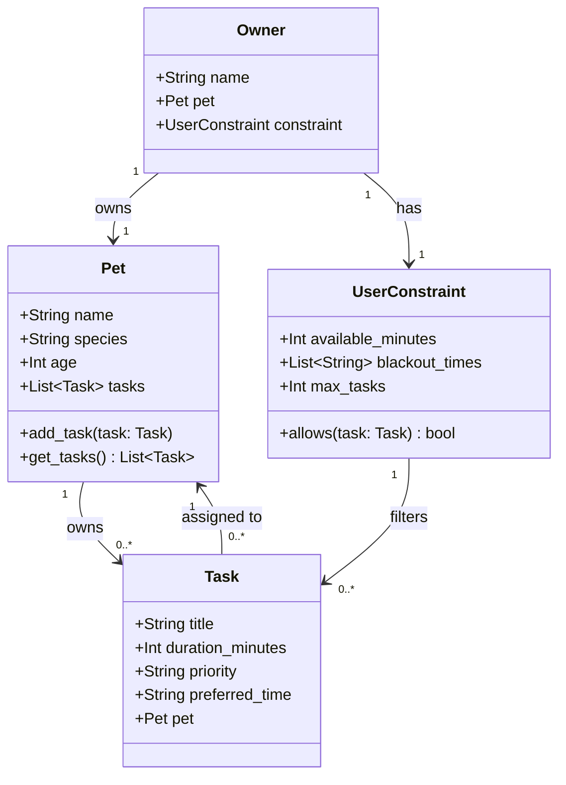

# PawPal+ Project Reflection

## 1. System Design

**a. Initial design**

- Briefly describe your initial UML design.
- What classes did you include, and what responsibilities did you assign to each?
  My initial UML design included the following classes:
  Owner: Has pets
  Pet: One single pet, holds data about it and what tasks correspond to it
  Task: Assigned to a pet, has information about the task
  UserConstraint: Owner's limitations

**b. Design changes**

- Did your design change during implementation?
- If yes, describe at least one change and why you made it.

Yes. I added a method to the UserConstraint class that made it check if the task's preferred time is in the owner's blackout times and if it exceeds the available time. I made this change to accomodate the preferences so that the scheduler could work around them.

But then I realized that on the website in Phase 2, it said I should have these core classes:
Task: Represents a single activity (description, time, frequency, completion status).
Pet: Stores pet details and a list of tasks.
Owner: Manages multiple pets and provides access to all their tasks.
Scheduler: The "Brain" that retrieves, organizes, and manages tasks across pets.

So I changed my design to match this.

---

## 2. Scheduling Logic and Tradeoffs

**a. Constraints and priorities**

- What constraints does your scheduler consider (for example: time, priority, preferences)?
- How did you decide which constraints mattered most?
  The scheduler considers priority, time, max tasks, and blackout time. I decided that the most important constraint was the priority, then frequency, then duration because the most important tasks should be finished first. Since frequency means it's recurring, it also mattered to me. Duration prioritizes shorter tasks so that more is done in a shorter time.

**b. Tradeoffs**

- Describe one tradeoff your scheduler makes.
- Why is that tradeoff reasonable for this scenario?
  The scheduler picks tasks in sorted order (priority > frequency > duration) so it might waste time by doing a long task first when it could have done two short tasks in the same time. However, I think this is reasonable because the owner would probably want to get the most important tasks done first, and if they have time left over, they can do the less important ones.

---

## 3. AI Collaboration

**a. How you used AI**

- How did you use AI tools during this project (for example: design brainstorming, debugging, refactoring)?
- What kinds of prompts or questions were most helpful?
  I used AI tools to help me implement the classes and make test cases.
  It was helpful when I prompted it with a general task asked it questions, like "what are some edge cases?" or "can you give me an example of a test case for this behavior?" It was also helpful when I asked it to explain its reasoning for a suggestion, which helped me understand the logic behind it and decide whether to accept it or not.

**b. Judgment and verification**

- Describe one moment where you did not accept an AI suggestion as-is.
- How did you evaluate or verify what the AI suggested?
  It had a pythonic suggestion where it told me to use itertools.combinations instead of a for loop, which is not very human readable.

---

## 4. Testing and Verification

**a. What you tested**

- What behaviors did you test?
- Why were these tests important?
  Chronological sorting: make sure that you can sort by the time it was created
  Daily recurrence: make sure that when you mark a task as complete, it creates a new one if it's daily or weekly
  Conflict detection: make sure that if two tasks overlap, it detects the conflict and gives a warning
  These tests were important because they ensure the scheduler behaves correctly under various scenarios and edge cases.

**b. Confidence**

- How confident are you that your scheduler works correctly?
- What edge cases would you test next if you had more time?
  I'm pretty confident that my scheduler works correctly because I tested the main behaviors and it passed all the tests. If I had more time, I would test edge cases like:
  available_minutes=0: every task should be skipped as "too long to fit." This tests that the scheduler doesn't crash on an empty window and that minutes_remaining correctly returns 0.
  Adding the same task object to the same pet twice — add_task() has no duplicate guard, so the task would probably twice in get_tasks().
  max_tasks=0 — every task should be skipped as "max tasks reached" before any time is consumed.

---

## 5. Reflection

**a. What went well**

- What part of this project are you most satisfied with?
  I'm satisfied with how the scheduling logic turned out, especially the way it handles constraints and priorities. I think it does a good job of balancing different factors to create a reasonable daily plan for the pet owner.

**b. What you would improve**

- If you had another iteration, what would you improve or redesign?
  I would improve the conflict detection logic to suggest possible solutions instead of just saying that there is a conflict.

**c. Key takeaway**

- What is one important thing you learned about designing systems or working with AI on this project?
  I learned that it's important to have a clear design and understanding of the problem before diving into implementation, especially when working with AI tools. It helps to have a solid foundation to build upon and makes it easier to evaluate AI suggestions in the context of the overall system.
